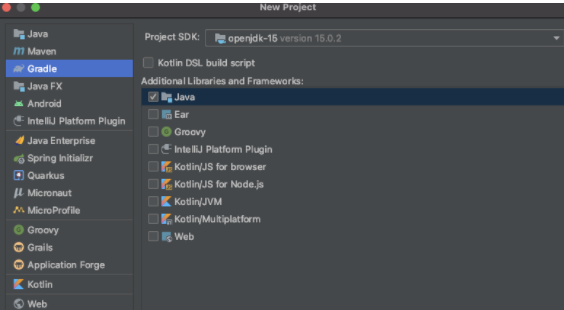

- Spring Initializr를 사용하지 않고 스프링 부트 프로젝트 생성.



### build.gradle

```
buildscript {
    ext{
        springBootVersion = '2.4.3'
    }
    repositories{
        mavenCentral()
        jcenter()
    }
    dependencies {
        classpath("org.springframework.boot:spring-boot-gradle-plugin:${springBootVersion}")
    }

}
apply plugin: 'java'
apply plugin: 'eclipse'
apply plugin: 'org.springframework.boot'
apply plugin: 'io.spring.dependency-management'

group 'org.example'
version '1.0-SNAPSHOT'

repositories {
    mavenCentral()
}

dependencies {
    testImplementation 'org.junit.jupiter:junit-jupiter-api:5.6.0'
    testRuntimeOnly 'org.junit.jupiter:junit-jupiter-engine'
    compile('org.springframework.boot:spring-boot-starter-web')
    testCompile('org.springframework.boot:spring-boot-starter-test')
}

test {
    useJUnitPlatform()
}
}
```

:: ext 키워드 : build.gradle에서 사용하는 전역변수. 여기서는 스프링부트의 해당 버전을 의존성으로 받음.

:: apply plugin : 선언한 플러그인 의존성들을 적용할것인지를 결정하는 코드

:: repositories: 각종 의존성들을 어떤 원격 저장소에서 받을것인지.

:: dependeencies: 프로젝트에 필요한 의존성 선언