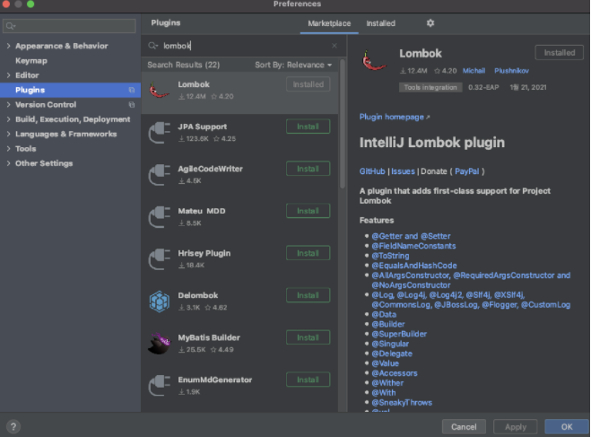
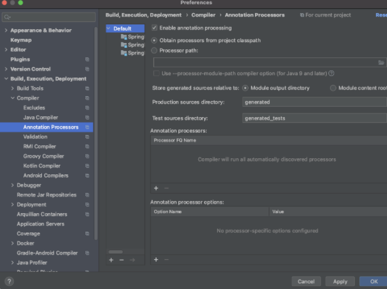

- 자바 개발시 자주 사용하는 코드 Getter,Setter,기본생성자, toString등을 어노테이션으로 자동으로 생성해줌.

### 의존성 추

```
dependencies {
    compile('org.projectlombok:lombok')
}
```

### plugin 설치


-action 단축키 command + shift + A-

### Enable annotation processing


- 의존성 추가와 enable annotation processing은 프로젝트마다 해주어야 함.

### 기능 테스트

```java
public class HelloResponseDtoTest {

   public class HelloResponseDtoTest {

   @Test
    public void lombokTest(){
        String name = "test";
        int amount = 10000;
        
        //생성자 확인
        HelloResponseDto dto =new HelloResponseDto(name,amount);
        
        //getter확인
        assertThat(dto.getName()).isEqualTo(name);
        assertThat(dto.getAmount()).isEqualTo(amount);
    }

}

}
```

### HelloController의 lombok을 이용한 변경

```java
@RestController
public class HelloController {

    //HTTP Get의 요청을 받을 수 있는 API를 만들어 줌.
    @GetMapping("/hello")
    //@RequestParam : 외부에서 API로 넘김 파라미터를 가져옴.
    public HelloResponseDto hello(@RequestParam("name") String
                                              name,
                                  @RequestParam("amount") int
                                                    amount) {
        return new HelloResponseDto(name,amount);
    }
}
```
:: "name"이라는 이름으로 넘겨준 값을 name메소드 파라미터에 저장함.

### Test code

```java
@Autowired
   
private MockMvc mvc;
@Test
public void returnHelloDto() throws Exception {
    String name = "hello";
    int amount = 1000;
    
    mvc.perform(
            get("/hello/dto")
                .param("name",name)
                .param("amount", String.valueOf(amount)))
            .andExpect(status().isOk())
            .andExpect(jsonPath("$.name", is(name)))
            .andExpect(jsonPath("$amount", is(amount)));
}
```

:: param에서 요청 파라미터를 설정, 값은 String만 가능하기 때문에 숫자등의 데이터도 문자열로 변경해주어야 함.

:: jsonPath : JSON응답값을 필드별로 검증.