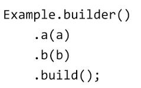
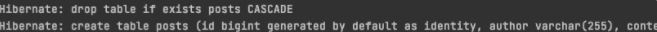
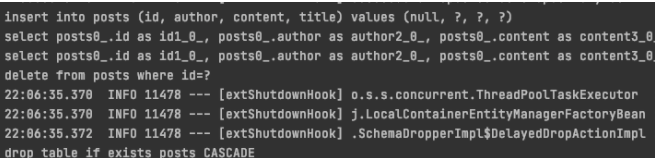
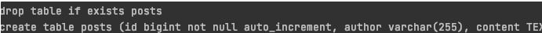
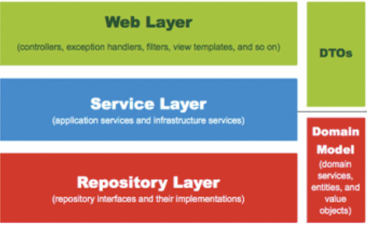

### 의존성 추가
```
dependencies{
    compile('org.springframework.boot:spring-boot-starter-data-jpa')
    compile('com.h2database:h2')
}
```
:: jpa 의존성과 h2 데이터베이스 의존성 추가.       
( h2데이터 베이스는 인 메모리 데이터 베이스로 재시작시 초기화 됨. 테스트 용도로 많이 사용)


### Entity class 생성
```java
import lombok.Builder;
import lombok.Getter;
import lombok.NoArgsConstructor;

import javax.persistence.Column;
import javax.persistence.GeneratedValue;
import javax.persistence.GenerationType;
import javax.persistence.Id;

@Getter //lombok
@NoArgsConstructor //lombok
@Entity //jpa , Table에 매칭할 클래스
public class Posts {

    @Id //PK
    @GeneratedValue(strategy = GenerationType.IDENTITY)
    private  Long id;

    @Column(length = 500, nullable =false)
    private  String title;

    @Column(columnDefinition = "TEXT", nullable = false)
    String content;

    private String author;

    @Builder
    public Posts(String title, String content,String author){
        this.title = title;
        this.content = content;
        this.author = author;
    }

}
```
:: @Entity  :기본적으로 class name의 카멜표기법을 언더스코어('_')네이밍으로 테이블 이름을 매칭
ex> exampleClass.java → example_class table

:: @Column : 명시하지 않아도 되지만, 추가적인 옵션을 설정 할 때 사용. String은 기본값으로 255의 length를 가지게 되고, 이를 변경하거나 타입을 변경할 수 있음.

:: @Builder : 어느 필드에 어떤 값을 채워야할지 명확하게 볼 수 있음. 그냥 생성자를 이용하는 경우 new Posts(content, title, author) 과 같이 잘못되게 값을 넣게 되면 실행 전에는 알기 어려움.    


### DB 접근자
```java
package com.study.springboot.domain.posts;

import org.springframework.data.jpa.repository.JpaRepository;

// JpaRepository<Entity Class, PK Type>
public interface PostsRepository extends JpaRepository<Posts, Long> {
}
```

:: Entity class 와 Entity Repository는 같이 위치해야 함.

### Test Code
```java
import org.junit.After;
import org.junit.Test;
import org.junit.runner.RunWith;
import org.springframework.beans.factory.annotation.Autowired;
import org.springframework.boot.test.context.SpringBootTest;
import org.springframework.test.context.junit4.SpringRunner;

import java.util.List;

import static org.assertj.core.api.Assertions.assertThat;

@RunWith(SpringRunner.class)
@SpringBootTest
public class PostsRepositoryTest {

    @Autowired
    PostsRepository postsRepository;

    @After
    public void cleanup(){
        postsRepository.deleteAll();
    }

    @Test
	  public void saveLoadPost(){
        String title = "test post";
        String content = "test post content";

        //save | update
        postsRepository.save(Posts.builder()
                .title(title)
                .content(content)
                .author("kimtaejun")
                .build()
        );

        //When 테이블에 있는 모든 데이터 조회.
        List<Posts> postsList = postsRepository.findAll();

        //then
        Posts posts = postsList.get(0);
        assertThat(posts.getTitle()).isEqualTo(title);
        assertThat(posts.getContent()).isEqualTo(content);
    }
}
```
:: .save : id가 존재한다면 update, 존재하지 않는다면 insert 쿼리를 실행

### 쿼리 로그 출력
main.resources 디렉토리 >New>resource Bundle >application

```properties
spring.jpa.show_sql = true
```




### MySQL형식로 변경하여 출력

```properties
spring.jpa.properties.hibernate.dialect=org.hibernate.dialect.MySQL5InnoDBDialect
```


### spring 웹 계층 (101p 그림 3-13)


:: Web Layer : 흔히 사용하는 컨트롤러 등의 뷰 템플릿 영역, 이 외에 외부 요청과 응답에 대한 전반적인 영역.

:: Service Layer : 서비스 영역 일반적으로 Controller 와 Dao의 중간 영역. @Transaactional 영역

:: Repository Layer : Database와 같이 데이터 저장소에 접근하는 영역 기존의 Dao에 해당.

:: Dtos : Dto의 영역 뷰 템플릿 엔진에서 사용될 객체나 Repository Layer에서 결과로 넘겨준 객체.

:: Domain Model : 모든 사람이 동일한 관점에서 이해하고, 공유할 수 있도록 단순화 시킨 것. @Entity ,Vo객체 등 포함.