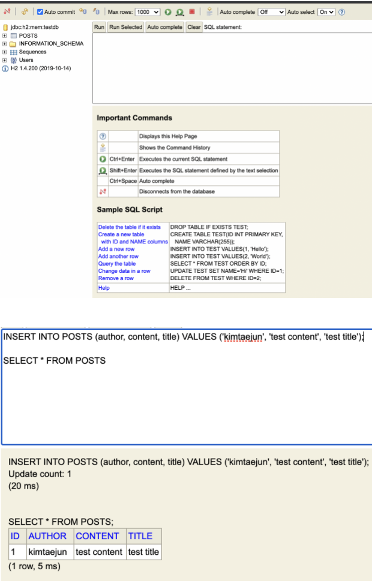

### 프로젝트 구조


##Create 구현
******
### PostsApiController.java
```java
package com.study.springboot.web;

import com.study.springboot.service.posts.PostsService;
import com.study.springboot.web.dto.PostsSaveRequestDto;
import lombok.RequiredArgsConstructor;
import org.springframework.web.bind.annotation.PostMapping;
import org.springframework.web.bind.annotation.RequestBody;
import org.springframework.web.bind.annotation.RestController;

@RequiredArgsConstructor
@RestController
public class PostsApiController {

    private final PostsService postsService;

    @PostMapping("/api/v1/posts")
    public Long save(@RequestBody PostsSaveRequestDto requestDto){
        return postsService.save(requestDto);
    }

}
```

### PostsService.java

```java
package com.study.springboot.service.posts;

import com.study.springboot.domain.posts.PostsRepository;
import com.study.springboot.web.dto.PostsSaveRequestDto;
import lombok.RequiredArgsConstructor;
import org.springframework.stereotype.Service;

@RequiredArgsConstructor
@Service
public class PostsService {
    private final PostsRepository postsRepository;

    @Transactional
    public Long save(PostsSaveRequestDto requestDto) {
        return postsRepository.save(requestDto.toEntity()).getId();
    }
}
```

### PostsSaveRequestDto.java

```java
package com.study.springboot.web.dto;

import com.study.springboot.domain.posts.Posts;
import lombok.Builder;
import lombok.Getter;
import lombok.NoArgsConstructor;

@Getter
@NoArgsConstructor
public class PostsSaveRequestDto {
    private String title;
    private String content;
    private String author;

    @Builder
    public PostsSaveRequestDto(String title, String content, String author){
        this.title = title;
        this.content = content;
        this.author = author;
    }

    public Posts toEntity(){
        return Posts.builder()
                .title(title)
                .content(content)
                .author(author)
                .build();
    }
}
```

:: @Autowired를 사용하지 않고 생성자로 빈을 주입 받음.(권장)

:: Dto 클래스는 Posts Entity 클래스와 거의 유사한 형태를 가지지만 이를 분리 시킴. 사소한 기능 변경을 Entity 클래스에서 변경하는 것은 너무 큰 변경.

:: Request와 Respinse용 클래스는 변경이 자주 이루어지기 때문에 Entity클래스를 이용하지 않고 철자하게 분리.(View Layer와 DB Layer의 분리)

### Test Code

```java
package com.study.springboot.web;

import com.study.springboot.domain.posts.Posts;
import com.study.springboot.domain.posts.PostsRepository;
import com.study.springboot.web.dto.PostsSaveRequestDto;
import org.junit.After;
import org.junit.Test;
import org.junit.runner.RunWith;
import org.springframework.beans.factory.annotation.Autowired;
import org.springframework.boot.test.context.SpringBootTest;
import org.springframework.boot.test.web.client.TestRestTemplate;
import org.springframework.boot.web.server.LocalServerPort;
import org.springframework.http.HttpStatus;
import org.springframework.http.ResponseEntity;
import org.springframework.test.context.junit4.SpringRunner;

import static org.assertj.core.api.Assertions.assertThat;
import java.util.List;

@RunWith(SpringRunner.class)
@SpringBootTest(webEnvironment = SpringBootTest.WebEnvironment.RANDOM_PORT)
public class PostApiControllerTest {
@LocalServerPort
private int port;

@Autowired
private TestRestTemplate restTemplate;

@Autowired
private PostsRepository postsRepository;

@After
public void cleanup()throws Exception{
    postsRepository.deleteAll();
}

@Test
public void createPosts(){
    //given
    String title = "test title";
    String content = "test content";

    PostsSaveRequestDto requestDto = PostsSaveRequestDto.builder()
            .title(title)
            .content(content)
            .author("kimtaejun")
            .build();

    String url = "http://localhost:" +port +"api/v1/posts";

    //when
    ResponseEntity<Long> responseEntity = restTemplate.postForEntity(url,requestDto, Long.class);

    //then
    assertThat(responseEntity.getStatusCode()).isEqualTo(HttpStatus.OK);
    assertThat(responseEntity.getBody()).isGreaterThan(0L);

    List<Posts> postsList = postsRepository.findAll();
    assertThat(postsList.get(0).getTitle()).isEqualTo(title);
    assertThat(postsList.get(0).getContent()).isEqualTo(content);

}
}
```

- Random Port 주입.   


## Read, Update 구현
*******

### PostsApiController.java

```java
//Read
@GetMapping("api/v1/posts/{id}")
public PostsResponseDto findById(@PathVariable Long id){
    return postsService.findById(id);
}

//Update
@PutMapping("/api/v1/posts/{id}")
public Long update(@PathVariable Long id, @RequestBody PostsUpdateRequestDto requestDto){
    return postsService.update(id, requestDto);
}
```

### postsService.java

```java
//Read
public PostsResponseDto findById(Long id) {
    Posts posts = postsRepository.findById(id).orElseThrow(()-> new
            IllegalArgumentException("해당 게시물이 없습니다. id = "+id));
    PostsResponseDto responseDto = new PostsResponseDto(posts);

    return responseDto;
}

//update
@Transactional
public Long update(Long id, PostsUpdateRequestDto requestDto) {
    Posts posts = postsRepository.findById(id).orElseThrow(()->
            new IllegalArgumentException("해당 게시물이 없습니다. id = "+id));
    posts.update(requestDto.getTitle(), requestDto.getContent());

    return id;
}

```

### PostsResponseDto.java

```java
package com.study.springboot.web.dto;

import com.study.springboot.domain.posts.Posts;

@Getter
@NoArgsconstructor
public class PostsResponseDto{
    private Long id;
    private String title;
    private String content;
    private String author;

    public PostsResponseDto(Posts entity){
        this.id = entity.getId();
        this.title =entity.getTitle();
        this.content = entity.getContent();
        this.author = entity.getAuthor();
    }
}
```

### PostsUpdateRequestDto.java

```java
package com.study.springboot.web.dto;

import lombok.Builder;
import lombok.Getter;
import lombok.NoArgsConstructor;

@Getter
@NoArgsConstructor
public class PostsUpdateRequestDto {
    private String title;
    private String content;

    @Builder
    public PostsUpdateRequestDto(String title, String content) {
        this.title = title;
        this.content = content;
    }
}
```

### Posts.java

```java
public void update(String title, String content){
    this.title =title;
    this.content = content;
}
```
:: Posts의 update 메소드에서는 쿼리문을 날리는 부분이 없음. 이는 JPA의 영속성 컨텍스트 때문. JPA Entity Manager가 활성화(Spring Data JPA사용시 default) 되어있을 때 @Transactional안에서 DB에서 데이터를 가져오면 영속성 컨텍스트가 유지된 상태. 데이터의 값을 변경하면, 트랜잭션이 끝나는 시점에 테이블에 변경을 반영함. (더티 체킹 dirty checking)
> *영속성 컨텍스트 : 엔티티를 영구저장하는 환경

### Read, Update Test Code(PostsApiControllerTest.java)

```java
@Test
    public void ReadPosts(){
        Posts savePosts =postsRepository.save(Posts.builder()
                .title("title")
                .content("content")
                .author("kimtaejun")
                .build());

        Long readId = savePosts.getId();
        String url = "http://localhost:"+port +"api/v1/posts/"+readId;

        PostsResponseDto responseObject = restTemplate.getForObject(url, PostsResponseDto.class);

        assertThat(responseObject.getTitle()).isEqualTo("title");
        assertThat(responseObject.getContent()).isEqualTo("content");
        assertThat(responseObject.getAuthor()).isEqualTo("kimtaejun");
    }
    
    @Test
    public void updatePosts(){
        String title = "first title";
        String content = "first content";
        String expectedTitle ="update title";
        String expectedContent = "update content";

        Posts savePosts =postsRepository.save(Posts.builder()
                .title(title)
                .content(content)
                .author("kimtaejun")
                .build());

        Long updateId = savePosts.getId();

        PostsUpdateRequestDto requestDto = PostsUpdateRequestDto.builder()
                .title(expectedTitle)
                .content(expectedContent)
                .build();

        String url = "http://localhost:"+port +"api/v1/posts/"+updateId;

        HttpEntity<PostsUpdateRequestDto> requestEntity = new HttpEntity<>(requestDto);

        //when
        ResponseEntity<Long> responseEntity =restTemplate.exchange(url, HttpMethod.PUT, requestEntity,Long.class);
        assertThat(responseEntity.getStatusCode()).isEqualTo(HttpStatus.OK);
        assertThat(responseEntity.getBody()).isGreaterThan(0L);

        List<Posts> postsList = postsRepository.findAll();
        assertThat(postsList.get(0).getTitle()).isEqualTo(expectedTitle);
        assertThat(postsList.get(0).getContent()).isEqualTo(expectedContent);

    }
```

:: save와 달리 save response Entity가 필요없기 때문에 바로 postsRepository.save를 이용하여 posts를 반환 받음. PostsSaveRequestDto.toEntity().getId()를 이용하여 id를 반환받는것도 가능함.

:: save부분은 @Before를 이용하여 리팩토링 가능.

:: Read기능은 톰캣을 이용하여 확인하였지만. 테스트 코드를 작성하는것을 연습하기 위해 작성합. 이를 위해 PostResponseDto 에 Getter와 NoArgsConstructor를 추가

### 톰캣을 이용한 조회 테스트

```properties
spring.h2.console.enabled=true
```
- application main 실행   
  http://localhost:8080/h2-console 접속


> ERROR : database not found   
> 이유 : 최신 h2에서는 보안상의 이유로 기본 db를 생성하지 않음.

- 해결
```properties
spring.datasource.url =jdbc:h2:mem:testdb
spring.datasource.data-username= sa
```
     
:: id =1 로 데이터를 등록.

### API 조회 확인.


## Delete 구현
*******

### PostsApiController.java

  ```java
  //Delete
      @DeleteMapping("/api/v1/posts/{id}")
      public void delete(@PathVariable Long id){
          postsService.delete(id);
      }
  ```

### PostsService.java

  ```java
  @Transactional
      public void delete(Long id){
          Posts posts = postsRepository.findById(id).orElseThrow(()->new
                  IllegalArgumentException("해당 게시물이 없습니다 id = "+id));
          postsRepository.deleteById(id);
      }
  ```

### PostsApiControllerTest.java

  ```java
  //Delete
      @Test
      public void PostsDelete(){
          //given
          String title = "test title";
          String content = "test content";
          PostsSaveRequestDto saveRequestDto = PostsSaveRequestDto.builder()
                  .title(title)
                  .content(content)
                  .author("kimtaejun")
                  .build();

          String url = "http://localhost:" +port +"api/v1/posts";

          //when
          ResponseEntity<Long> saveResponseEntity = restTemplate.postForEntity(url,saveRequestDto, Long.class);

          //then
          assertThat(saveResponseEntity.getStatusCode()).isEqualTo(HttpStatus.OK);
          assertThat(saveResponseEntity.getBody()).isGreaterThan(0L);

          //저장 확인
          List<Posts> postsList = postsRepository.findAll();
          assertThat(postsList.get(0).getTitle()).isEqualTo(title);
          assertThat(postsList.get(0).getContent()).isEqualTo(content);

          Long deleteId = postsList.get(0).getId();

          url +="/"+deleteId;

          restTemplate.delete(url);

          List<Posts> postsList2 = postsRepository.findAll();
          assertThat(postsList2.size()).isEqualTo(0);

      }
  ```