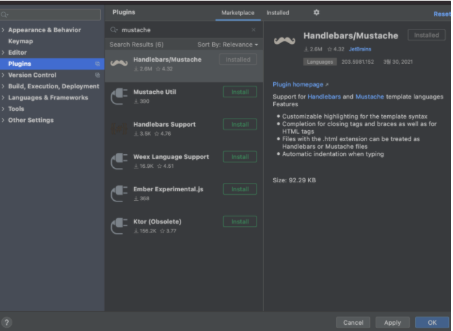
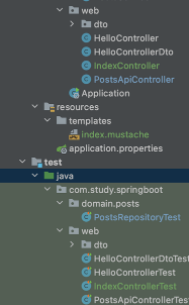

### plugin 설치
     
:: action : command +shift +A

### build.gradle 의존성 추가.

```java
compile('org.springframework.boot:spring-boot-starter-mustache')
```

:: 머스테치의 파일 위치 : 기본적으로 src/main/resource/templates 위치에 머스테치 파일을 두면 스프링 부트에서 자동으로 로딩.    


### index.mustache

```html
<!DOCTYPE HTML>
<html>
<head>
    <title>Spring Boot Web Service</title>
    <meta http-equiv ="Content-Type" content="text/html; charset=UTF-8">
</head>
<body>
    <h1>스프링 부트로 시작하는 웹 서비스</h1>
</body>
</html>
```

### IndexController.java
```java
package com.study.springboot.web;

import org.springframework.stereotype.Controller;
import org.springframework.web.bind.annotation.GetMapping;

@Controller
public class IndexController {

    @GetMapping("/")
    public String index(){
        //mustache로 인해 앞의 경로와 확장자는 자동으로 지정됨.
        return "index";
    }
}
```

:: return 문자열에 앞에는 경로인 src/main/resource/templates 가 추가되고 , 뒤에는 확장자인 .mustache가 추가된다.

### IndexControllerTest.java

```java
package com.study.springboot.web;

import org.junit.Test;
import org.junit.runner.RunWith;
import org.springframework.beans.factory.annotation.Autowired;
import org.springframework.boot.test.context.SpringBootTest;
import org.springframework.boot.test.web.client.TestRestTemplate;
import org.springframework.test.context.junit4.SpringRunner;

import static org.assertj.core.api.Assertions.assertThat;
import static org.springframework.boot.test.context.SpringBootTest.WebEnvironment.RANDOM_PORT;

@RunWith(SpringRunner.class)
@SpringBootTest(webEnvironment = RANDOM_PORT)
public class IndexControllerTest {

    @Autowired
    private TestRestTemplate restTemplate;

    @Test
    public void mainPageLoading(){
        //when
        String body = this.restTemplate.getForObject("/",String.class);

        //then
        assertThat(body).contains("스프링 부트로 시작하는 웹 서비스");
    }
}
```

### Application 구동


- 프론트 엔드 라이브러리 부트스트랩, 제이쿼리 사용.
    > 1. 외부 CDN 사용 (실제 서비스에서는 외부 서비스에 의존이 생기기 때문에 잘 사용하지 않음.)
    > 2. 직접 라이브러리를 다운.

:: 1번의 방법은 코드만 추가하면 되기 때문에 간편. 해당 방식을 사용하여 구현하기로 함.    
:: 모든 머스테치 화면에서 필요한 공통 영역을 분리하여 레이아웃 파일을 만듦.

### header.mustache

```html
<!DOCTYPE HTML>
<html>
<head>
    <title>Spring Boot Web Service</title>
    <meta http-equiv ="Content-Type" content="text/html; charset=UTF-8" />
    <link rel = "stylesheet" href ="http://stackpath.bootstrapcdn.com/bootstrap/4.3.1/css/bootstrap.min.css"/>
</head>
<body>

```

### footer.mustache

```html
<script src="https://code.jquery.com/jquery-3.3.1.min.js"></script>
<script src="https://stackpath.bootstrapcdn.com/bootstrap/4.3.1/js/bootstrap.min.js"></script>

</body>
</html>
```

:: html은 head를 모두 실행하고 body를 실행.   
js부분의 호출이 느려질 수 있기 때문에 페이지 로딩속도를 높이기 위해서 화면을 그리는 css먼저 실행하고, body에서 js부분을 실행한다. 이 때 bootstrap은 jquery에 의존하기 때문에 jquery를 먼저 호출.


### index.mustach(수정)

```html
{{>layout/header}}
<h1>스프링 부트로 시작하는 웹 서비스</h1>
{{>layout/footer}}
```
  :: {{>}}은 현재 머스테치 파일의 위치를 기준으로 다른 파일을 가져옴.