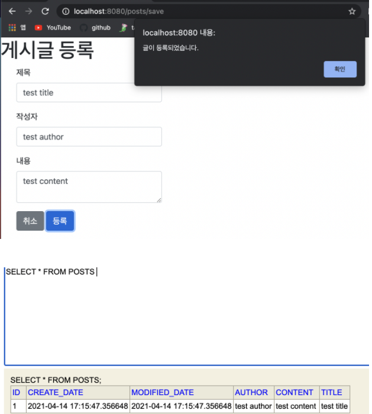

## 등록 생성
****

### index.mustache

```html
{{>layout/header}}
<h1>스프링 부트로 시작하는 웹 서비스</h1>
<div class = "col-md-12">
    <div class = "row">
        <div class="col-md-6">
            <a href="/posts/save" role="button" class ="btn btn-primary">글 등록</a>
        </div>
    </div>
</div>
{{>layout/footer}}
```

### indexController.java

```java
@GetMapping("/posts/save")
    public String postsSave(){
        return "posts-save";
    }
```

### posts-save.mustache

```html
{{>layout/header}}

<h1>게시글 등록</h1>

<div class ="col-md-12">
    <div class="col-md-4">
        <form>
            <div class="form-group">
                <label for="title">제목</label>
                <input type="text" class="form-control" id="title" placeholder="제목을 입력하세요">
            </div>
            <div class="form-group">
                <label for="author">작성자</label>
                <input type="text" class="form-control" id="author" placeholder="작성자를 입력하세요">
            </div>
            <div class="form-group">
                <label for="title">제목</label>
                <textarea class="form-control" id="content" placeholder="내용을 입력하세요"></textarea>
            </div>
        </form>
        <a href="/" role="button" class="btn btn-secondary">취소</a>
        <button type="button" class="btn btn-primary" id="btn-save">등록</button>
    </div>
</div>

{{>layout/footer}}
```

### index.js (src/main/resources/static/js/app)

```js
var main = {
    init: function () {
        var _this = this;
        $('#btn-save').on('click', function () {
            _this.save();
        });
    },
    save: function () {
        var data = {
            title: $('#title').val(),
            author: $('#author').val(),
            content: $('#content').val()
        };

        $.ajax({
            type: 'POST',
            url: '/api/v1/posts',
            dataType: 'json',
            contentType: 'application/json; charset=utf-8',
            data: JSON.stringify(data)
        }).done(function () {
            alert("글이 등록되었습니다.");
            window.location.href = '/';
        }).fail(function(error){
            alert(JSON.stringify(error));
        });
    }
};

main.init()
```
:: API를 호출하는 JS

::var main = 하고 선언하는 이유 : 브라우저의 스코프는 공용으로 쓰이기 때문에 var init, var save 로 정의해두면 다른 js파일에서 같은 이름으로 정의할 경우 덮어씌워지게 됨. 이를 방지하기 위해 var main에서 해당 객체 내에서만 유효하도록 스코프를 지정해줌.

### footer.mustache

```html
<script src = "/js/app/index.js"></script>
```

:: 절대 경로로 시작. 기본적으로 src/main/resources/static에 위치한 js,css, image 등 정적 파일들은 URL에서 /로 설정.

### 구동 화


## 전체 게시글 조회 화면
*******

###PostsRepository.java

```java
package com.study.springboot.domain.posts;

import org.springframework.data.jpa.repository.JpaRepository;
import org.springframework.data.jpa.repository.Query;
import java.util.List;

// JpaRepository<Entity Class, PK Type>
public interface PostsRepository extends JpaRepository<Posts, Long> {

    @Query("SELECT p FROM Posts p ORDER BY p.id DESC")
    List<Posts> findAllDesc();
}
```
:: SpringDataJpa 에서 제공하지 않는 메소드는 @Query를 이용해도 됨.

### PostsService.java

```java
// readOnly = true -> 조회 속도 개선.
    @Transactional(readOnly = true)
    public List<PostsListResponseDto> findAllDesc(){
        //posts의 stream을 map을 통해 Post -> new PostsListResponseDto(posts), List를 반환.
        return postsRepository.findAllDesc().stream()
                .map(PostsListResponseDto::new)
                .collect(Collectors.toList());
    }
```

### PostsListResponseDto.java

```java
package com.study.springboot.web.dto;

import com.study.springboot.domain.posts.Posts;
import lombok.Getter;

import java.time.LocalDateTime;

@Getter
public class PostsListResponseDto {
    private Long id;
    private String title;
    private String author;
    private LocalDateTime modifiedDate;

    public PostsListResponseDto(Posts entity){
        this.id = entity.getId();
        this.title =entity.getTitle();
        this.author= entity.getAuthor();
        this.modifiedDate =entity.getModifiedDate();
    }
}
```

### IndexController.java

```java
package com.study.springboot.web;

import com.study.springboot.service.posts.PostsService;
import lombok.RequiredArgsConstructor;
import org.springframework.stereotype.Controller;
import org.springframework.ui.Model;
import org.springframework.web.bind.annotation.GetMapping;

@RequiredArgsConstructor
@Controller
public class IndexController {

    private final PostsService postsService;

    @GetMapping("/")
    public String index(Model model){
        //서버 템플릿 엔진에서 사용할 수 있는 객체 저장 (attributeName으로 index.mustache에 전달)
        model.addAttribute("posts", postsService.findAllDesc());
        //mustache로 인해 앞의 경로와 확장자는 자동으로 지정됨.
        return "index";
    }

    @GetMapping("/posts/save")
    public String postsSave(){
        return "posts-save";
    }
}
```
:: PostsService 필드를 주입받고 해당 객체의 메소드를 이용하여 List를 반환받아, 모델에 저장.

### index.mustache

```html
<!--게시글 목록 -->
    <table class="table table-horizontal table-bordered">
        <thead class="thead-strong" >
        <tr>
            <th>게시글 번호</th> <th>제목</th> <th>작성자</th> <th>최종 수정</th>
        </tr>
        </thead>
        <tbody id ="tbody">
        <!--posts list 순회-->
        {{#posts}}
            <tr>
                <!--필드 주입-->
                <td>{{id}}</td>
                <td>{{title}}</td>
                <td>{{author}}</td>
                <td>{{modifiedDate}}</td>
            </tr>
        {{/posts}}
        </tbody>
    </table>
</div>
```
