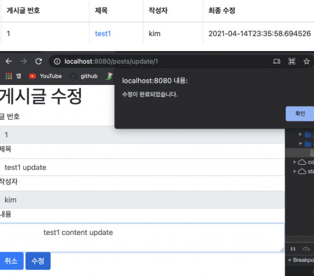
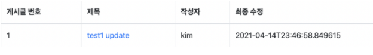
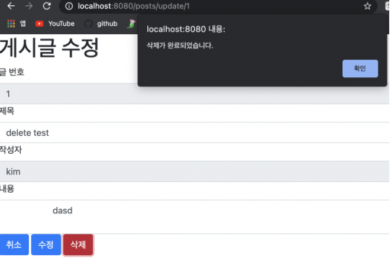

## Update 화면 구현
*******
### posts-update.mustache
```html
{{>layout/header}}
<h1>게시글 수정</h1>
<div id="col-md-12">
    <div id="col-md-4">
        <form>
            <div id="form-group">
                <label for="id">글 번호</label>
                <input type="text" class="form-control"
                       id="id" value="{{post.id}}" readonly>

                <label for="title">제목</label>
                <input type="text" class="form-control"
                       id="title" value="{{post.title}}" >

                <label for="author">작성자</label>
                <input type="text" class="form-control"
                       id="author" value="{{post.author}}" readonly>

                <label for="content">내용</label>
                <textarea class="form-control" id="content">
                    {{post.content}}</textarea>
            </div>
        </form>
        <a href="/" role="button" class="btn btn-primary">취소</a>
        <button type="button" class="btn btn-primary" id="btn-update">수정</button>
    </div>
</div>

{{>layout/footer}}
```

:: post는 Model로 넘겨받은 객체(PostsService.findById())

:: id 와 author에는 readonly속성 부여

### index.js

```js
var main = {
    init: function () {
       
        $('#btn-update').on('click', function (){
            _this.update();
        })
    },

        update: function (){
                var data = {
                    title: $('#title').val(),
                    content: $('#content').val()
                };
        
                var id = $('#id').val();
        
                $.ajax({
                    type:'PUT',
                    url:'/api/v1/posts/'+id,
                    dataType:'json',
                    contentType:'application/json; chatset=utf-8',
                    data:JSON.stringify(data)
                }).done(function (){
                    alert("수정이 완료되었습니다.");
                    window.location.href ="/";
                }).fail(function (error){
                    alert(JSON.stringify(error));
                });
            }
```
:: author 와 id는 변경하지 않음. 메소드 타입 PUT

### IndexController.java

```java
@GetMapping("/posts/update/{id}")
    public String postUpdate(@PathVariable Long id, Model model){
        PostsResponseDto dto = postsService.findById(id);
        model.addAttribute("post", dto);

        return "posts-update";
    }
```
:: 화면을 불러오는 것이므로 GetMapping, 모델에 PostsService의 findById(id)로 id에 해당하는 post객체를 넘겨줌.

### index.mustache

```html
{{#posts}}
            <tr>
                <!--필드 주입-->
                <td>{{id}}</td>
                <td><a href="/posts/update/{{id}}">{{title}}</a></td>
                <td>{{author}}</td>
                <td>{{modifiedDate}}</td>
            </tr>
        {{/posts}}
```
:: title에 링크를 주어 해당 업데이트 페이지로 이동할 수 있게 함.

### 업데이트 테스
 트    
:: id, author에 readonly속성을 주어 수정 불가능.


## Delete 화면 구현.
********

### posts-update.mustache

```html
<button type ="button" class="btn btn-danger" id="btn-delete">삭제</button>
```
::부트스트랩 btn 타입에는, btn(회색), btn btn-primary(파랑), success(초록), warning(노랑), info(하늘), danger(빨강), default(하양) 가 있다.

```js
delete: function (){
var id = $('#id').val();

$.ajax({
    type:'DELETE',
    url:'/api/v1/posts/'+id,
    dataType:'json',
    ContentType:'application/json; charset=utf-8'
}).done(function (){
    alert("삭제가 완료되었습니다.");
    window.location.href= "/";
}).fail(function (error){
    alert(JSON.stringify(error));
});
}
```

### 삭제 테스트

