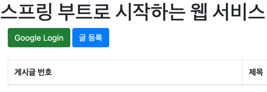
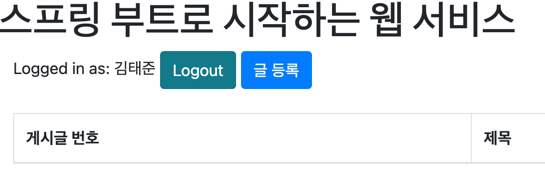
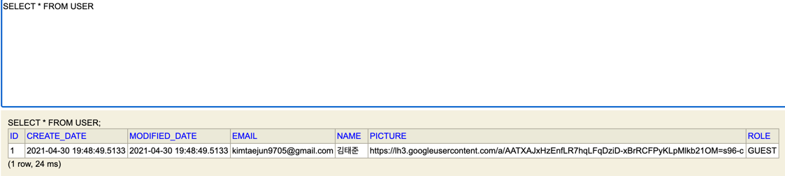
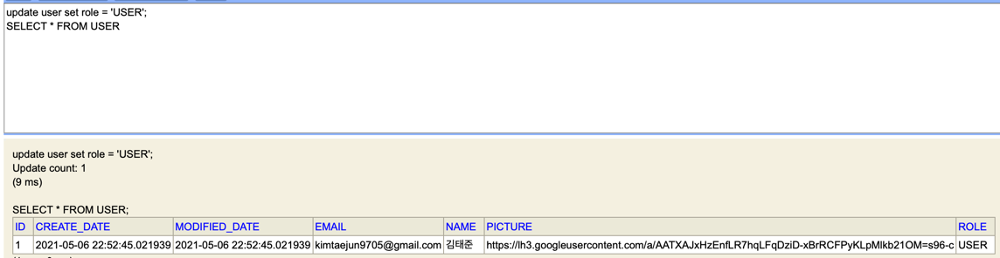

##User 엔티티와 Repository 생성

***********************

###domain/user/User.java

````java
@Getter
@NoArgsConstructor
@Entity
public class User extends BaseTimeEntity {
    @Id
    @GeneratedValue(strategy = GenerationType.IDENTITY)
    private Long id;

    @Column(nullable = false)
    private String name;

    @Column(nullable = false)
    private String email;

    @Column
    private String picture;

    @Enumerated(EnumType.STRING)
    @Column(nullable = false)
    private Role role;

    @Builder
    public User(String name, String email, String picture, Role role){
        this.name =name;
        this.email=email;
        this.picture = picture;
        this.role= role;
    }

    public User update(String name, String picture){
        this.name = name;
        this.picture = picture;
        return this;
    }

    public String getRoleKey(){
        return this.role.getKey();
    }


}
````
:: 엔티티의 필드로는 id, name, email, picture, role을 생성하고,    
name 과 picture 필드는 수정할 수 있게 만들어준다.
게스트인지, 유저인지 확인 할 수 있더록 Role의 key를 가져올 수 있는 메소드 작성.    
:: @Enumerated(Enumtype.STRING) : 기본적으로 int 형태로 enum값을 저장하게 되는데,    
무엇을 의미하는지 알기 어렵기 때문에 String형태로 변경.

###domain/user/Role enum class
````java
@Getter
@RequiredArgsConstructor
public enum Role {
    GUEST("ROLE_GUEST","손님"),
    USER("ROLE_USER","일반 사용자");

    private final String key;
    private final String title;
}
````
:: 스프링 시큐리티에서의 권한 코드는 항상 ROLE_XXX의 형태이다.
때문에 키값을 ROLE_XXX형태로 작성함.


###domain/user/UserRepository interface
````java

public interface UserRepository extends JpaRepository<User,Long> {
    //email로 이미 가입된 이메일인지 확인.
    Optional<User> findByEmail(String email);
}

````
:: findByEmail : 소셜 로그인으로 반환되는 값인 email을 통해 이미 생성된 사용자인지를    
판별하기 위한 메소드.


##OAuth 라이브러리를 이용한 소셜 로그인
**********

###build.gradle 의존성 추가
````
    compile('org.springframework.boot:spring-boot-starter-oauth2-client')
````
:: 소셜 로그인 등 클라이언트 입장에서 소셜 기능 구현시 필요한 의존성으로  
스프링 시큐리티 oauth2 client와 jose를 기본으로 관리해 준다.


### config/auth/SecurityConfig.java
````java
@RequiredArgsConstructor
@EnableWebSecurity
public class SecurityConfig extends WebSecurityConfigurerAdapter {
    private final CustomOAuth2UserService customOAuth2UserService;

    @Override
    protected void configure(HttpSecurity http) throws Exception {
        http
                .csrf().disable()
                .headers().frameOptions().disable()
            .and()
                .authorizeRequests()
                .antMatchers("/","./css/**","/images/**",
                        "/js/**","/h2-console/**").permitAll()
                .antMatchers("/api/v1/**").hasRole(Role.USER.name())
                .anyRequest().authenticated()
            .and()
                .logout()
                    .logoutSuccessUrl("/")
            .and()
                .oauth2Login()
                    .userInfoEndpoint()
                        .userService(customOAuth2UserService);

    }
}

````

:: Spring Security에서는 H2 데이터 베이스 콘솔의 접근을 차단 한다.    
때문에 csrf를 중지하고 x-frame-options을 중지한 후 h2-console url 요청을 허용해 주어야 한다.    

:: authorizeRequests : URL별 권한을 관리설정 하는 옵션의 시작점.    
authorizeRequests가 선언되어야 antMatchers 옵션을 사용할 수 있다.

:: antMatchers : 권한 관리 대상을 지정. permitAll을 이용하여 모두에게 권한을 주거나,    
Role.USER.name()과 같이 제한된 접근을 허용할 수 있다.

::anuRequest : antMatchers에서 지정된 url 이외의 나머지 url을 나타난다.    
.authenticated ->인증된 사용자에게만 허용    
<br>


###config/auth/customOAuth2UserService.java
````java
@RequiredArgsConstructor
@Service
public class CustomOAuth2UserService implements OAuth2UserService<OAuth2UserRequest, OAuth2User> {

    private final UserRepository userRepository;
    private final HttpSession httpSession;

    @Override
    public OAuth2User loadUser(OAuth2UserRequest userRequest) throws OAuth2AuthenticationException {
        OAuth2UserService<OAuth2UserRequest, OAuth2User> delegate = new DefaultOAuth2UserService();
        OAuth2User oAuth2User = delegate.loadUser(userRequest);

        String registrationId = userRequest.getClientRegistration().getRegistrationId();
        String userNameAttrbuteName = userRequest.getClientRegistration().getProviderDetails()
                .getUserInfoEndpoint().getUserNameAttributeName();

        OAuthAttributes attributes = OAuthAttributes.
                of(registrationId, userNameAttrbuteName, oAuth2User.getAttributes());

        User user = saveOrUpdate(attributes);

        httpSession.setAttribute("user", new SessionUser(user));

        return new DefaultOAuth2User(Collections.singleton(new
                SimpleGrantedAuthority(user.getRoleKey())),
                attributes.getAttributes(),
                attributes.getNameAttributesKey());

    }

    private User saveOrUpdate(OAuthAttributes attributes) {
        User user = userRepository.findByEmail(attributes.getEmail())
                .map(entity -> entity.update(attributes.getName(), attributes.getPicture()))
                .orElse(attributes.toEntity());

        return userRepository.save(user);
    }


}
````
:: registrationId : 로그인 진행중인 서비스를 구분하기 위한 값.
ex)네이버 로그인, 구글 로그인

::userNameAttributeName : 로그인 진행시 키가되는 필드 값.
    구글의 기본 코드는 sub

::OAuthAttributes : service를 통해 가져온 OAuth2User의 attribute를 담을 클래스.

:: SessionUser : 세션에 사용자 정보를 저장하기 위한 Dto        
<br>


### config/auth/dto/OAuthAttributes.java
````java
@Getter
public class OAuthAttributes {
    private Map<String,Object> attribute;
    private String nameAttributeKey;
    private String name;
    private String email;
    private String picture;

    @Builder
    public OAuthAttributes(Map<String,Object> attribute, String nameAttributeKey,
                           String name, String email, String picture){

        this.attribute = attribute;
        this.nameAttributeKey = nameAttributeKey;
        this.name = name;
        this.email =email;
        this.picture = picture;

    }

    public static OAuthAttributes of(String registrationId, String userNameAttributeName, Map<String,Object> attribute){
        return ofGoogle(userNameAttributeName,attribute);
    }

    public static OAuthAttributes ofGoogle(String userNameAttributeName, Map<String, Object> attribute){
        return OAuthAttributes.builder()
                .name((String)attribute.get("name"))
                .email((String)attribute.get("email"))
                .picture((String)attribute.get("picture"))
                .attribute(attribute)
                .nameAttributeKey(userNameAttributeName)
                .build();
    }
    public User toEntity(){
        return User.builder()
                .name(name)
                .email(email)
                .picture(picture)
                //User 정보가 없을 경우이기 때문에 기본권한을 Guest로 설정.
                .role(Role.GUEST)
                .build();
    }

}
````
:: 반환하는 사용자 정보는 Map이기 때문에 값 하나하나를 변환해 주어야함 of~ 메소드 사용.    
:: 추후에 registrationId를 통해 google이 아닌 네이버의 OAuthAttributes 객체를 돌려줄 수 있다.
<br>


###config/auth/dto/SesstionUser.java
````java
@Getter
public class SesstionUser implements Serializable {
    private String name;
    private String email;
    private String picture;

    public SesstionUser(User user){
        this.name = user.getName();
        this.email = user.getEmail();
        this.picture = user.getPicture();
    }
}
````
:: SesstionUser 에는 인증된 사용자의 정보만 필요하기 때문에 name, email,picture 필드면 필요하다.
user 객체를 전달받아 해당 값을 설정한다.

:: 해당 필드들은 User 클래스에도 있지만 이를 사용하지 않는다. User 클래스는 Entity 클래스이고,
다른 Entity 클래스와 관계를 형성 할 수 있기 때문에 성능 이슈 등이 발생할 수 있다.(Serializable 대상에 모두 포함 됨)
    
    * Serializable(직렬화)란?
        -java에서 사용되는 Object,Data 등을 외부의 자바 시스템에서도 사용할 수 있도록
        byte 형태로 변환하는 것.
        -JVM 메모리에 상주되어 있는 객체 데이터를 byte로 변환.
        -역 직렬화 : 직렬화된 byte데이터를 다시 객체데이터로 변환하는 것.
<br>

### Login View 구성하기
````html
{{#userName}}
    Logged in as: <span id="user">{{userName}}</span>
    <a href="/logout" class="btn btn-info active" role="button">Logout</a>
{{/userName}}
{{^userName}}
    <a href="/oauth2/authorization/google" class="btn btn-success active" role="button">Google Login</a>
{{/userName}}
````

:: mustache에서는 if 문이 없음 #은 true 일때 ^은 false일 때를 나타낸다.
따라서 userName이 존재할 때에는 로그인 되어있다는 메시지와 로그아웃 버튼을 출력하고, userName이 존재하지 않을 때(로그인 x)일때는
로그인 버튼을 보여준다.

:: 로그아웃과 로그인 URL은 스프링 시큐리티에서 기본적으로 제공하는 URL을 사용하였다. 별도의 컨트롤러를
생성하지 않아도 된다.


- #### Model에 userName 저장
````java
private final HttpSession httpSession;
SesstionUser user = (SesstionUser) httpSession.getAttribute("user");
if(user !=null)
    model.addAttribute("userName",user.getName());
````
:: service에서 유저가 로그인을 하면 httpSession에 SesstionUser을 저장하도록 구성함.(setSesstion(...))

:: httpSession을 주입받아 사용한다. 내부적으로는 session에 관련돤 api를 호출 할 때 Servlet Container에게 
요청한다.   
httpServletRequest.getSession()과 같이 처리된다.   

:: 세션에 저장된 값이 있을 경우에만 userName을 저장한다.

### View 실행



####User테이블 확인.

:: ROLE 이 GUEST이기 때문에 포스트 생성시 403에러 발생.


:: ROLE을 USER로 변경 후 생성 성공.
