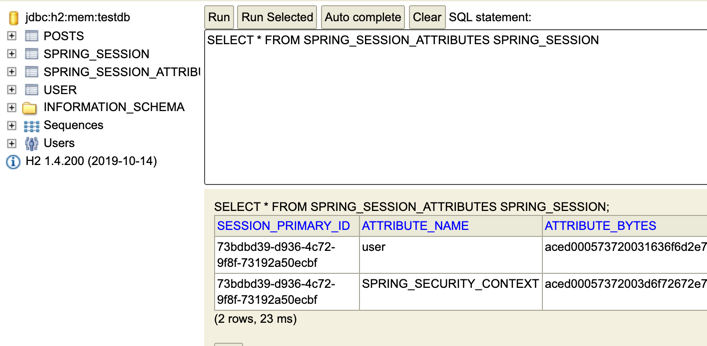

* 문제 : 애플리케이션을 재실행 하면 로그인이 풀림.
* 원인 : 세션이 내장 톰캣의 메모리에 저장되기 때문.

기본적으로 세션은 실행되는 Web Application Server의 메모리에 저장된다. 때문에 재실행시 항상 초기화가 이루어진다.
또한 한 가지 문제점이 더 발생하는데. 2대 이상의 서버에서 서비스를 한다면 톰캣마다 세션 동기화 설정을 해주어야 한다는 점이다.
이러한 문제점들 때문에 세션 저장소를 사용한다.    

    - 데이터 베이스를 세션 저장소로 사용    
    - Redis, Memcahed 같은 메모리 DB를 세션 저장소로 사용한다.(Business to Consumer 서비스에서 많이 사용) 

        *Redis : Reomote Dictionary Server로 키-값 구조로 데이터를 저장하는 비 관계형 데이터베이스 관리시스템.
        *Memcahed : 범용 분산 캐시 시스템으로 RAM에 캐시처리

###의존성 추가
```java
    compile('org.springframework.session:spring-session-jdbc')
```

###properties 추가
````properties
spring.session.store-type=jdbc
````

###추가된 session table
