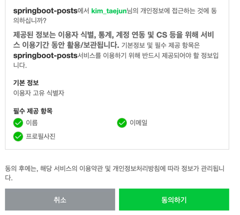

* 네이버 오픈 API : https://developers.naver.com/apps/#/wizard/register

* ### 네이버의 다양한 API


* ### 받아올 정보 선택 


 :: 콜백 url은 google때와 마찬가지로 host/login/oauth2/code/naver 이다.
 
* ### 생성된 Client ID,Secret


* ### properties 추가
네이버는 spring security를 지원하지 않기 때문에 직접 입력해주어야 한다.
````properties
#naver registration
spring.security.oauth2.client.registration.naver.client-id=client-ID
spring.security.oauth2.client.registration.naver.client-secret=client-Secret
spring.security.oauth2.client.registration.naver.redirect-uri={baseUrl}/{action}/oauth2/code/{registrationId}
spring.security.oauth2.client.registration.naver.authorization-grant-type=authorization_code
spring.security.oauth2.client.registration.naver.scope.=name,email,profile_image
spring.security.oauth2.client.registration.naver.client-name=Naver

#naver provider
spring.security.oauth2.client.provider.naver.authorization-uri=http://nid.naver.com/oauth2.0/authorize
spring.security.oauth2.client.provider.naver.token-uri=https://nid.naver.com/oauth2.0/token
spring.security.oauth2.client.provider.naver.user-info-uri=https://openapi.naver.com/v1/nid/me
spring.security.oauth2.client.provider.naver.user-name-attribute=response
````
:: 스프링 시큐리티에서는 하위 필드를 명시할 수 없기 때문에 최상위 필드만 user_name으로 지정이 가능하다.    
:: 네이버의 회원 조회시 데이터는 JSON으로 반환된다. 응답값 중 최상위 필드는 resultCode, message, response고,
때문에 이름을 얻기 위해서는 response로 지정해주고 자바 코드에서 id를 추출해야 한다.


### OAuthAttribute.java
````java
public static OAuthAttributes ofNaver(String userNameAttributeName, Map<String, Object> attribute){
        Map<String, Object> response = (Map<String, Object>) attribute.get("response");
        return OAuthAttributes.builder()
                .name((String)response.get("id"))
                .email((String)response.get("email"))
                .picture((String)response.get("picture"))
                .attribute(attribute)
                .nameAttributeKey(userNameAttributeName)
                .build();
    }
````
:: <String,Object> 타입으로 attribute에서 response 데이터를 가져오고 해당 값들을 넣어준다.

### 네이버 로그인 화면


