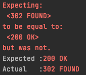

* 기존에는 게시글 등록 등의 API를 그냥 호출 할 수 있었지만 시큐리티를 적용한 후에는 인증된 사용자만     
API를 호출 할 수 있다. 기존의 테스트 코드에서는 인증권한을 받는 부분이 없으므로 정상적으로 작동할 수 없게된다.    
   -> 사용자가 호출하는 것 처럼 수정해야 함.
  
:: CustomOAuth2UserService를 생성하는데 필요한 소셜 로그인 관련 설정값이 없기 때문에 에러 발생.

:: src/main 과 src/test는 각자의 환경을 가지고 test에 application.properties가 없으면 main에서 가져오게 됨
. 하지만 oauth.properties는 가져올 수 있는 범위가 아니기 때문에 에러가 발생한다.

### properties 생성
````properties
spring.jpa.show_sql = true
spring.h2.console.enabled=true
spring.jpa.properties.hibernate.dialect-org.hibernate.dialect.MySQL5InnoDBDialect
spring.session.store-type=jdbc

#Test OAuth
spring.security.oauth2.client.registration.google.client-id=test
spring.security.oauth2.client.registration.google.client-secret=test
spring.security.oauth2.client.registration.google.scope=profile, email
````

### 302 FOUND
    
:: 스프링  시큐리티 설정 떄문에 인증되지 않은 사용자의 요청을 redirect한다.

### 의존성 추가
````java
    testCompile('org.springframework.security:spring-security-test')
````

### 사용자 인증이 필요한 테스트 코드에 어노테이션 추가
````java
@WithMockUser(roles="USER")
````
:: 사용자 인증을 필요로 하는 테스트 코드에 @WithMockUser 어노테이션으로 인증된 모의 사용자를 만들어준다.
여기서는 create와 update 테스트에 추가하였고, ROLE_USER의 권한을 가지게 된다.

### MockMvc 사용
 ````java
@Autowired
private WebApplicationContext context;

private MockMvc mvc;

@Before
public void setup(){
  mvc = MockMvcBuilders
           .webAppContextSetup(context)
           .apply(springSecurity())
           .build();
}
````
 :: 매번 테스트 시작전에 MockMvc 인스턴스를 생성한다.

### create, update test 변경
````java
 //when
mvc.perform(post(url)
      .contentType(MediaType.APPLICATION_JSON)
      .content(new ObjectMapper().writeValueAsString(saveRequestDto)))
      .andExpect(status().isOk());

//then
List<Posts> all = postsRepository.findAll();
assertThat(all.get(0).getTitle()).isEqualTo(title);
assertThat(all.get(0).getContent()).isEqualTo(content);
````
:: restTemplate를 이용하던 부분을 MockMvc를 사용하도록 변경해준다.
본문 영역은 문자열로 표한하기 위해 JSON으로 변환한다 update 메소드에서는 post가 아닌 put을 사용하면 된다.

* 수정 후 테스트 성공     

  

### returnHello
````java 
    @Test
    public void returnHello() throws Exception {
        String hello = "hello";

        //GET 요청과 검증.
        mvc.perform(get("/hello"))
                .andExpect(status().isOk())
                .andExpect(content().string(hello));
    }

}
````
 :: @WebMvcTest를 사용하는 returnHello에서는 여전히 아래와 같은 에러가 발생한다.   
- No qualifying bean of type 'com.study.springboot.config.auth.CustomOAuth2UserService'

        - 이유 : 처음 properties설정으로 시큐리티는 잘 작동하지만 @WebMvcTest는 CutomOAuth2UserService를 스캔하지 않는다.
            @ControllerAdvice, @controller를 읽는다. 즉 @Repository, @Service, @Conponent는 스캔 대상이 아니다.
            때문에, SecurityConfig를 읽었지만 이를 생성하기 위해 필요한 CustomOAuth2UserService를 읽지 못해 발생하는 에러이다.

### SecurityConfig를 스캔 대상에서 제
````java
@WebMvcTest(controllers = HelloController.class, excludeFilters = {
        @ComponentScan.Filter(type = FilterType.ASSIGNABLE_TYPE, classes = SecurityConfig.class)
})
````

- java.lang.IllegalStateException: Failed to load ApplicationContext

      - 이유 : @EnableJpaAuditing을 사용하기 위해서는 최소 하나의 @Entity클래스가 필요하다.
        @EnableJpaAuditing과 @SpringBootApplication이 함께 있어 @WebMvcTest에서 스캔하게 되어 발생.

### config/JpaConfig
````java
@Configuration
@EnableJpaAuditing
public class JpaConfig {}
````
:: Application.java 에서 @EnableJpaAuditing을 제거하고 JpaConfig 클래스를 만들어 분리한다.