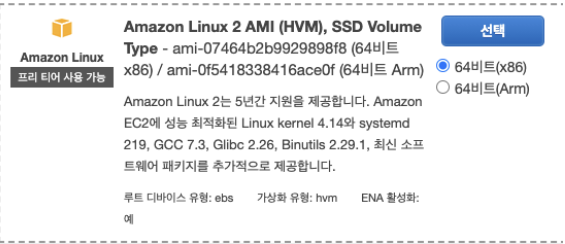
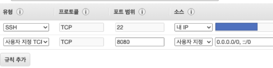
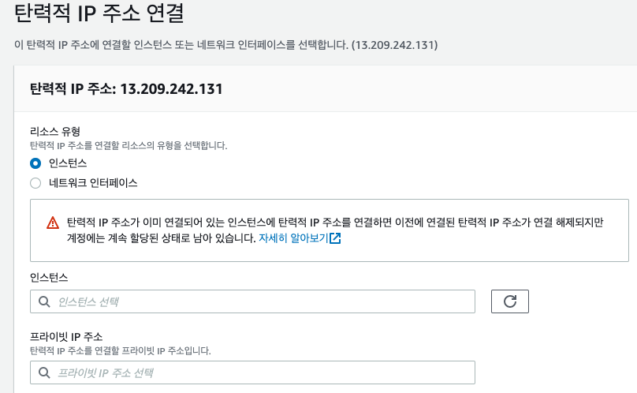
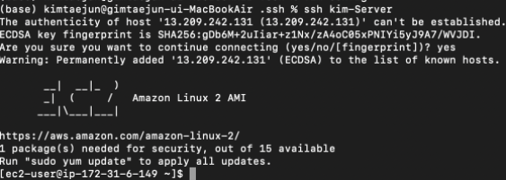
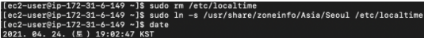

##AWS 설정
****

### Amazon Linux2 AMI 인스턴스 생성

  

### 보안 그룹 설정


### 탄력적 IP 설정

:: 탄력적 IP(고정 IP)할당 후 등록, IP 생성후 바로 인스턴스와 연결해줘야 함(연결 안되어 있으면 요금 부과)

##실행
*****
> AWS와 같은 외부 서버로 SSH 접속을 하려면 매번 다음과 같이 긴 명령어를 입력해야 한다.
> >pem key 다운로드 받은 후 항상 자동으로 실행되도록 하기 위해 .ssh 디렉토리에 넣어주고 config파일 생성.

### pem key 복사
    ````
    cp ~/Documents/kimtaejun-Webserver.pem ~/.ssh/
    chmod 600 ~/.ssh/kimtaejun-Webserver.pem
    ````
### .ssh 디렉토리에 config파일 생성.

    > Host 서비스명    
    HostName ec2 탄력적 IP주소    
    User ec2-user       
    IdentityFile ~/.ssh/pem파일 이름   


Host 서비스명
HostName ec2 탄력적 IP주소
User ec2-user
IdentityFile ~/.ssh/pem파일 이름


### 정해준 서비스명으로 서버 실행.
  ````
  ssh 서비스명
  ````
  

### 리눅스2 서버에 java 설치

    ```
    //install 가능 리스트 확인
    sudo yem list | grep jdk

    sudo yum install -y java-1.8.0-openjdk-devel.x86_64

    ```


### 타임존 변경
````
sudo rm /etc/localtime
sudo ln -s /usr/share/zoneinfo/Asia/Seoul /etc/localtime
````


### Host Name 변경
```
sudo vim /etc/sysconfig/network
> HOSTNAME= 서비스네임

sudo reboot

sudo vim /etc/hosts
> 127.0.0.1. 등록한 호스트네임

//확인
curl 등록한 호스트 네임
```