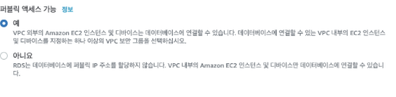
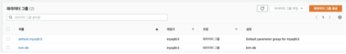
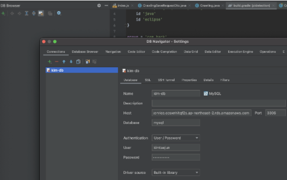

## RDS 생성
*****

### 외부 엑세스

:: 생성시 외부 엑세스 허용.

### 파라미터 설정

:: 생성한 데이터 베이스와 버전을 맞춰야 한다.

>생성후 수정할 파라미터
> >-time zone : Asia/Seoul    
> 
> >-Character Set    
> >- character_set_client : utf8mb4
> >- character_set_connection : utf8mb4
> >- character_set_database : utf8mb4
> >- character_set_filesystem : utf8mb4
> >- character_set_results : utf8mb4
> >- character_set_server : utf8mb4
> >- collation_connection : utf8mb4_general_ci
> >- collation_server : utf8mb4_general_ci
>
> >-Max Connection : 사양에 따라 프리티어 60~150


### 보안 그룹 설정
허용할 EC2 인스턴스나 IP를 인바운드로 추가.
여기서는 앞에서 생성한 EC2의 보안 그룹과 내 PC의 IP를 추가하였다.

## 연동
****
###IntelliJ에서의 연동
1. Database Navigator plugin을 설치.
2. Aaction 검색으로 Database Browser 실행.

- RDS 접속 정보 등록

  ::Host에는 RDS의 연결&보안의 엔드포인트 정보를 등록한다.
  
````sql
USE RDS데이터베이스 이름;
````


### EC2에서의 RDS 접근

- EC2 접속
````
ssh 서비스명
ssh kim-Server
````

- MySQL 설치
````
sudo yum install mysql
````

- 접속
````
mysql -u 계정 -p -h Host주소
mysql -u kimtaejun -p -h RDS엔드포인트
````

