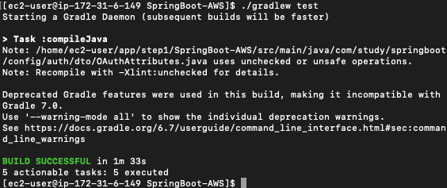
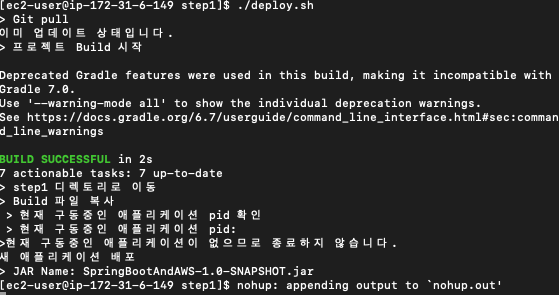
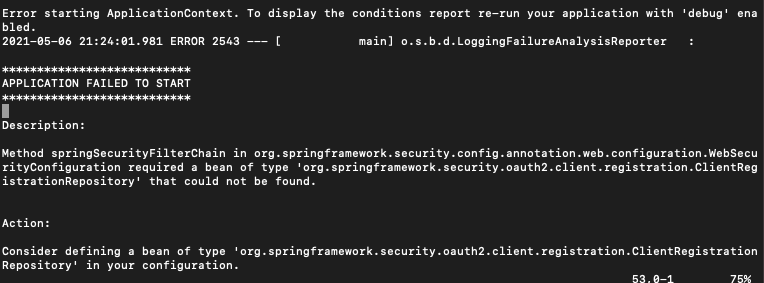
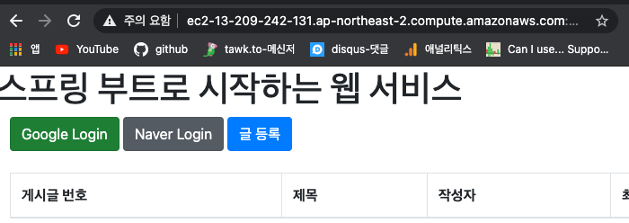

# EC2 서버에 프로젝트 배포하기
*****
> ####배포
>- git clone, git pull을 통해 새로운 프로젝트를 받음.
>- Gradle, Maven을 통해 프로젝트 테스트와 빌드.
>- EC2서버에서 해당 프로젝트 실행, 재실행.

- EC2서버 접속
````
ssh 서비스명
ssh kim-Server
````

- git clone(~/app/step1)
````
git clone 저장소 주소

./gradlew test
````


## 배포 스크립트 만들기
******
- step1/deploy.sh
    ````shell
    REPOSITORY=/home/ec2-user/app/step1
    PROJECT_NAME=SpringBoot-AWS
    
    cd $REPOSITORY/$PROJECT_NAME/
    
    echo "> Git pull"
    git pull
    
     echo ">프로젝트 Build 시작"
    ./gradlew build
    
    echo "> step1 디렉토리로 이동"
    cd $REPOSITORY/
    
    echo "> Build 파일 복사"
    cp $REPOSITORY/$PROJECT_NAME/build/libs/*.jar $REPOSITORY/
    
    echo "> 현재 구동중인 애플리케이션 pid 확인"
    #prgep :process id 추출, -f : 프로세스 이름으로 찾기
    CURRENT_PID=$(pgrep -f ${PROJECT_NAME}.*.jar)
    
    echo "> 현재 구동중인 애플리케이션 pid: $CURRENT_PID"
    
    if [ -z "$CURRENT_PID" ]; then
            echo ">현재 구동중인 애플리케이션이 없으므로 종료하지 않습니다."
    else
            echo "> kill -15 $CURRENT_PID"
            kill -15 $CURRENT_PID
            sleep 5
    fi 
    
    echo "새 애플리케이션 배포"
    #tail -n 으로 가장 최신 파일 변수에 저장.
    JAR_NAME=$(ls -tr $REPOSITORY/ |grep jar | tail -n 1)
    
    echo "> JAR Name: $JAR_NAME"
    
    #터미널을 종료해도 애플리케이션이 계속 구동될 수 있도록 nohup 명령어 사용
    nohup java -jar $REPOSITORY/$JAR_NAME 2>&1 &
    ````
1. 프로젝트 폴더로 이동하여 git pull로 최신 버전을 가져온다.
2. ./gradlew build로 프로젝트 빌드를 수행.
3. build결과물은 .jar파일을 복사하여 이동(step1으로)
4. 현재 구동중인 애플리케이션이 있다면 종료.
5. $REPOSITORY 위치에서 새로 실행할 jar파일을 탐색. -n 옵션으로 가장 최신 파일을 저장함.
6. 찾은 jar파일을 nohup으로 실행.    
    -일반적으로 java -jar로 실행하지만 터미널 종료시 같이 종료됨.    
    -nohup 명령어로 실행하면 터미널이 종료되어도 계속 구동된다.
   
- 생성한 스크립트에 실행 권한 추가
    ````
    chmod +x ./deploy.sh
    ````
- 스크립트 실행
    ````
    ./deploy.sh
    ````
    
  
- nohup.out 의 내용중 에러 발생로그.
    
:: ClientRegistrationRepository를 실행할 때 클라이언트 ID와 클라이언트 Secret이 필요하지만 보안상 git에 application-oauth.properies를 올리지 않았기 때문에 발생하는 에러.
  

>app 디렉토리에 application-ouath.properties를 생성하고 내용을 그대로 붙여 넣은 후 deploy.sh파일을 아래와 같이 수정.
````shell
nohup java -jar \
-Dspring.config.location=classpath:/application.properties,/home/ec2-user/app/application-ouath.properties,/home/ec2-user/app/appication-real.properties,classpath:/appplication-real.properties\-Dspring.profiles.active=real\
$REPOSITORY/$JAR_NAME 2>&1 &
````

### EC2 도메인으로 접속하여 배포 확인.
