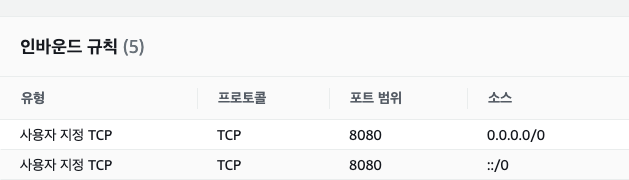
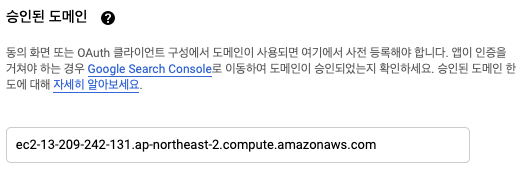
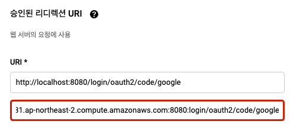
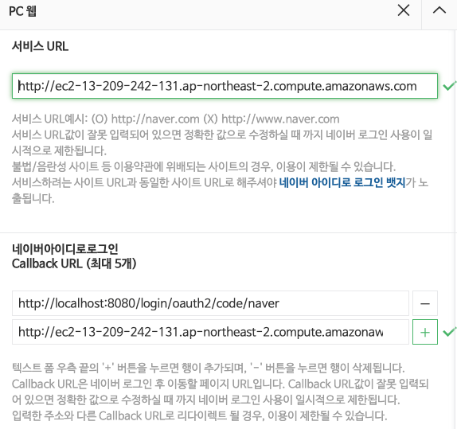

### EC2 보안그룹 확인

:: 8080이 열려있는지 확인, 열려있지 않다면 추가.

### Google에 EC2 도메인 등록
> https://console.cloud.google.com/home/dashboard 접속

- API 및 서비스 > OAuth 동의 화 >앱 등록 수정 >승인된 도메인에 추가.

  ::http를 사용하지 않고 EC2의도메인을 입력한
  
- API 및 서비스 > 사용자 인증 정보 > 사용자 클릭 > 승인된 리디렉션 추가
   
:: http://EC2도메인:8080/login/oauth2/code/google
  

### Naver에 EC2 도메인 등록
> https://developers.naver.com/apps/#/myapps

- API설정 > PC웹

  :: 서비스 URL은 하나밖에 등록할 수 없다. 여러개를 등록하고 싶다면 네이버 서비스를 하나 더 생성해야 함.
  :: Callback URL 은 http://EC2도메인:8080/login/oauth2/code/naver