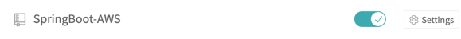
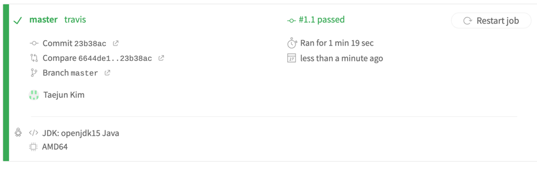
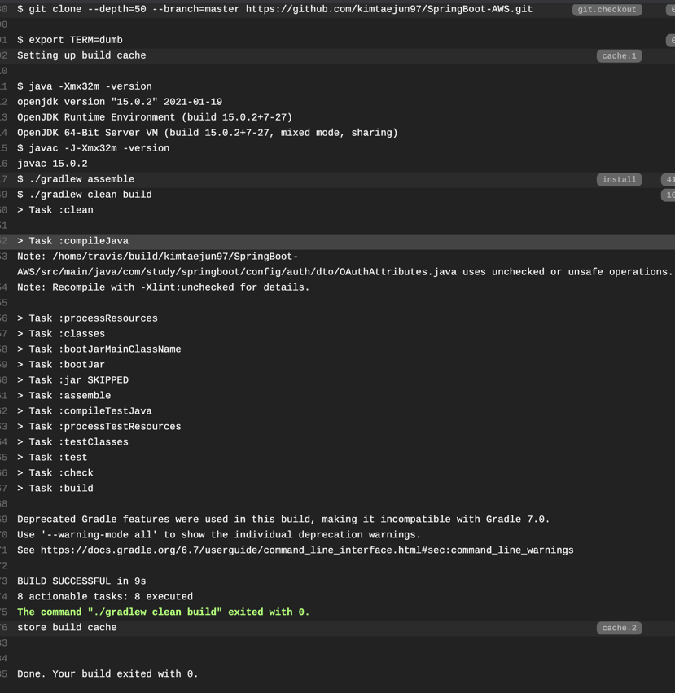
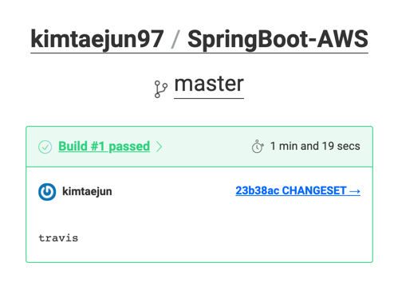

# CI & CD


> CI : Continuous Integration - 지속적 통합. 코드 버전 관리를 하는 VCS시스템에 PUSH가 되면 자동으로 테스트와 빌드가 수행되어 안정적인 배포 파일을 만드는 과정.

> CD : Continuous Deployment -지속적인 배포. 빌드 결과를 자동으로 운영 서버에 무중단 배포까지 진행되는 과정.

    - 하나의 프로젝트를 여러 개발자가 함께 개발을 진행하고, 그러다 보니 각자가 개발한 코드를 합쳐야 하기 때문에 병합일을 정하여 병합을 진행. -> 생산성 감소.    
    때문에 지속해서 코드가 통합되는 환경(CI)를 구축.
    - 수십 수백 대의 서버에 배포를 해야하는 상황이 생기면 수동으로 배포가 힘듦. -> 자동화하기 위해 CD구축.

### 마틴 파울러의 CI 4가지 규칙
****
1. 모든 소스 코드가 살아있고(현재 실행되고) 누구든 현재 소스에 접근할 수 있는 단일 지점을 유지할 것.    

   
2. 빌드 프로세스를 자동화해서 누구든 소스로부터 시스템을 빌드하는 단일 명령어를 사용할 수 있게 할 것.

   
3. <mark style='background-color:#fff5b1 '>**테스팅을 자동화**</mark>해서 단일 명령어로 언제든지 시슽메에 대한 건전한 테스트를 실할 수 있게 할 것.


4. 누구나 현재 실행 파일을 얻으면 지금까지 가장 완전한 실행 파일을 얻었다는 확신을 하게 할 것.


## Travis CI 연동하기
****
:: Travis CI는 깃허브에서 제공하는 무료 CI 서비스.   

### 웹 서비스 설정.
1. https://travis-ci.org/ 접속, 깃허브 계정으로 로그인.
2. 계정 > setting에서 Repository 활성화

   
### 프로젝트 설정.
1. build.gradle과 같은 위치에 .travis.yml 파일 생성.
```yaml
language: java
jdk:
  - openjdk8
    
branches:
  only:
    - master
      
      
# Travis CI 서버의 Home
cache:
  directories:
    - '$Home/ .m2/repository'
    - '$Home/ .gradle'
  

script: "./gradlew clean build"

# CI 실행 완료 시 메일로 알람.
notifications: 
  email:
    recipients: 
      - 이메일 주소
```

    - branches : 어느 브랜치가 푸시될 때 수행될지. 
    - cache : 그레이들을 통해 의존성을 받게되면 이를 디렉토리에 캐시하여 같은 의존성은 다음 배포때 부터 받지 않도록 함.
    - script : 푸시되었을 때 수행할 명령어.
    - notifications : Travis CI 실행 완료시 자동으로 알람.

### 웹 서비스 저장소 페이지



### 실행 완료 이메일행 알람
