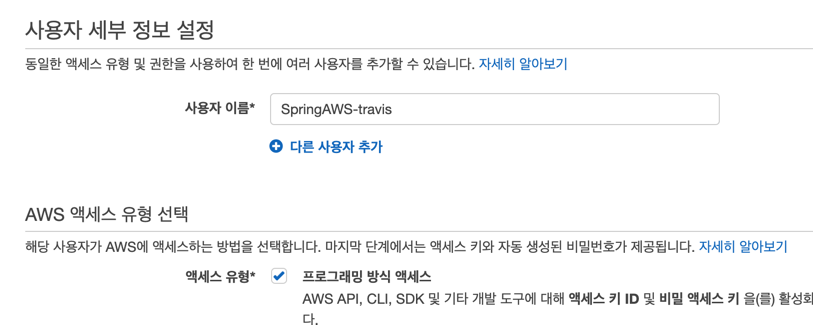

    - AWS S3는 이미지 등의 정적 파일 뿐만 아니라 배포파일들을 관리하는 등의 기능을 지원 함.
    - jar파일을 전달하는 역할을 수행한다.

:: CodeDeploy에서 빌드와 배포를 모두 수행할 수 있지만 빌드 없이 배포만 필요할 때 대응하기 어렵기 때문에 빌드와 배포를 분리.

# Travis CI와 S3 연동.
******
::일반적으로 ASW 서비스에 외부 서비스가 접근할 수 없기 때문에 접근 가능 권한을 가진 key를 생성해서 사용해야 한다.

> IAM : Identity and Access Management, AWS에서 제공하는 서비스의 접근 방식과 권한을 관리.
## 사용자 추가
*****
1. AWS 웹콘솔 > IAM > 사용자 > 사용자 추가
   

2. 액세스 유형 선택
     
   :: 프로그래밍 방식 액세스.


3. 권한 설정.
   
     
   :: 기존 정책 AmazonS3FullAccess , AWSCodeDeployfullAccess 
   

4. 추가 완료.   

:: 액세스 키 ID와 비밀 액세스 키가 생성됨.
   

## travis CI에 키 등록.
*******
1. Travis > Settings > Environment Variables

   
    -이제 등록된 ㄱ밧을 .travis.yml에서 $AWS_ACCESS_KEY 와 같이 사용할 수 있다.
   

## S3 버킷
********
1. 퍼블릭 액세스 차단

   :: Jar 파일을 누구나 내려받을 수 있게 되면 코드,설정값, 주요 키값이 유출될 수 있다.
2. 생성 완료

   
3. .travis.yml 추가
    ```yaml
    before_deploy:
      - zip -r SpringBoot-AWS *  #프로젝트 이름
      - mkdir -p deploy
      - mv SpringBoot-AWS.zip deploy/SpringBoot-AWS.zip
        
    deploy: 
      - provider: s3
        access_key_id: $AWS_ACCESS_KEY #travis에서 설정한 이름
        secret_access_key: $AWS_SECRET_KEY #travis에서 설정한 이름
        bucket: springaws-build #bucket이름
        region: ap-northeast-2
        skip_cleanup: true
        acl: private #zip파일의 접근 제한
        local_dir: deploy #before_deploy에서 생성한 디렉토리
        wait-untill-deployed: true
    ```
        - before_deploy : deploy 명령어 실행전 수행. CodeDeploy는 jar을 인식하지 못하므로 Jar + 기타 설정 파일들을 모아 압축.        
        - mkdir -p deploy : Travis CI가 실행중인 위치해 디렉토리 생성.
        - deploy : S3로 파일 업로드 혹은 CodeDeploy로 배포 등 외부 서비스와 연동될 행위 선언.
        - local_dir : 해당 위치의 파일들만 S3로 전송.

4. build, save 확인.


   
## EC2에 IAM역할 추가하기.
**********
> 역할과 사용자 : 역할은 AWS 서비스에만 할당할 수 있는 권한이고(EC2,CodeDeploy...), 사용자는 AWS 서비스 외에 사용할 수 있는 권한이다.(로컬PC, IDC 서버...)

### 1. IAM > 역할 > 역할 만들기     

   

      - AWS 서비스 EC2 선택.
   
      
      
      - 정책으로 AMazonEc2RoleforAWSCodeDeploy 선택.
### 2. 생성 완료.

   
### 3. EC2 인스턴스 우클릭 > 보안 > IAM 역할 수정.     

      - 역할 수정 후 재부팅.

### 4. CodeDeploy 에이전트 설치
```
aws s3 cp s3://aws-codedeploy-ap-northeast-2/latest/install . --region ap-northeast-2
```

> 완료 :download: s3://aws-codedeploy-ap-northeast-2/latest/install to ./install

```
// 실행권한 주고 설치 실행.
chmod +x ./install
sudo ./install auto
```

> - ERROR : /usr/bin/env: ruby: No such file or directory    
> - ruby를 설치하여 해결, sudo yum install ruby

- agent 실행 확인
```
sudo service codedeploy-agent status
```

### 5. CodeDeploy를 위한 권한 생성.


### 6. CodeDeploy 생성

