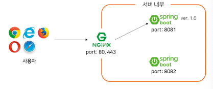
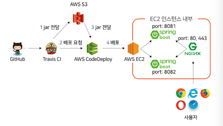
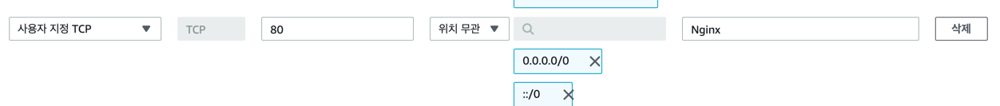
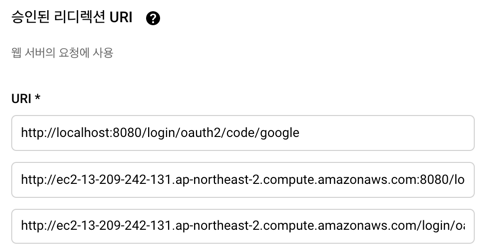
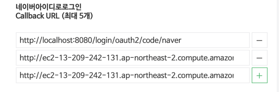
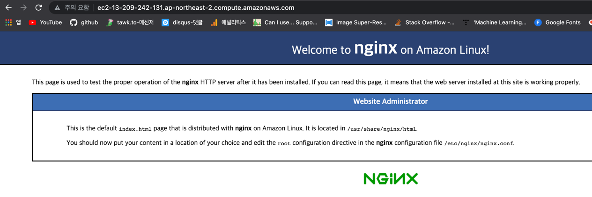
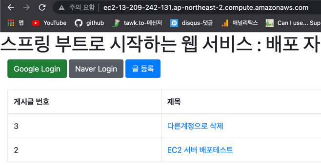

# 무중단 배포

> 이전 까지는 배포를 하는 동안 애플리케이션이 종료된다는 문제가 남아있다. 때문에 중단 없이 배포를 하는 방법이 필요.

    - AWS에서 블루 그린(Blue-Green)무중단 배포.
    - 도커를 이용한 웹 서비스 무중단 배포.
    - L4 스위치를 이용한 무중단 배포.
    - 엔진엑스(Nginx)를 이용한 무중단 배포.

 #### 📌 Nginx : 웹 서버, 리버스 프록시, 캐싱, 로드 밸런싱, 미디어 스트리 등을 위한 오픈소스 소프트웨어.
:: 리버스 프록시 : 클라이언트를 대신해 한 대 이상의 서버로부터 자원을 추출하여 클라이언트로 반환해주는 프록시 서버의 일종.


## 구조(371p~
*********
      

    - 하나의 서버와 스프링 부트 Jar을 2대 사용.
    - 엔진 엑스는 80(http), 443(https)
    - 스프링 부트는 8081, 8082 포트.

1. 사용자는 서비스 주소로 접속(80 or 443)
2. 엔진 엑슨느 사용자의 요청을 받아 현재 연결된 스프링 부트로 요청 전달.
3. 8081에 연결되어 있다면 신규 배포를 8082에 배포하고 nginx reload 명령어를 통해 8082를 바라보도록 함.
4. 이러한 과정을 8081, 8082 번갈아 가며 실행.

### - 배포 자동화부터 무중단 배포까지.


1. push가 이루어지면 Travis CI에서 build된 jar파일을 S3에 전달하고 CodeDeploy에 배포 요청을 보낸다.
2. CodeDeploy에서는 jar을 전달받아 EC2서버에 배포하고, EC2 서버에서는 NginX와 연결되지 않은 스프링 부트에 배포를 실행한다. 
3. Nginx에서는 배포가 이루어진 스프링 부트를 새로 연결한다

## 엔진엑스 설치, 연동
*******
```
sudo amazon-linux-extras install nginx1
sudo service nginx start
```

### - 보안그룹 추가

:: Nginx의 포트는 기본적으로 80. 접속할때는 주소에서 포트를 입력하지 않아도 됨.
:: 기존에 8080이 아닌 80 포트로 주소가 변경되므로, 관련된 설정이 있다면 변경해주어야 함.(소셜 로그인 )
https://console.cloud.google.com/
       
https://developers.naver.com/apps/#/list


- 80포트 접속

  
### Nginx 프록시 설정.
```
sudo vim /etc/nginx/nginx.conf
```

```
 location / {
        proxy_pass http://localhost:8080;
        proxy_set_header X-Real-IP $remote_addr;
        proxy_set_header X-Forwarded-For $proxy_add_x_forwarded_for;
        proxy_set_header Host $http_host;
}
```
    - proxy_pass : 엔진 엑스로 요청이 오면 localhost:8080으로 전달.
    - proxy_set_header : 실제 요청 데이터를 헤더의 각 항목에 할당.
- 재시작.
```
sudo service nginx restart
```

- 연동 확인

\
